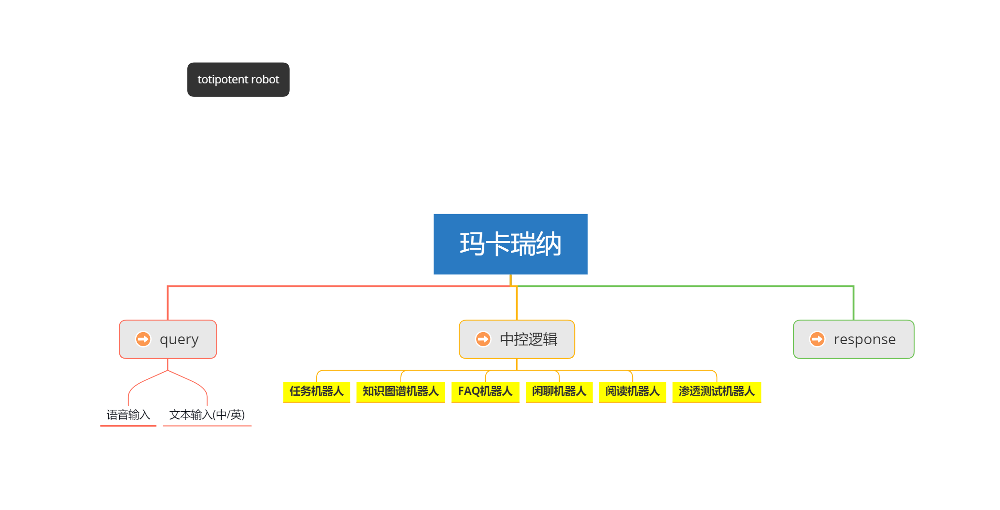
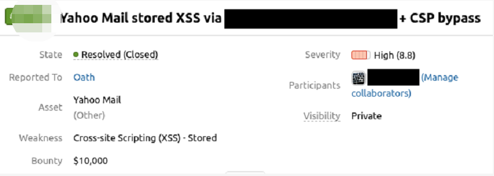
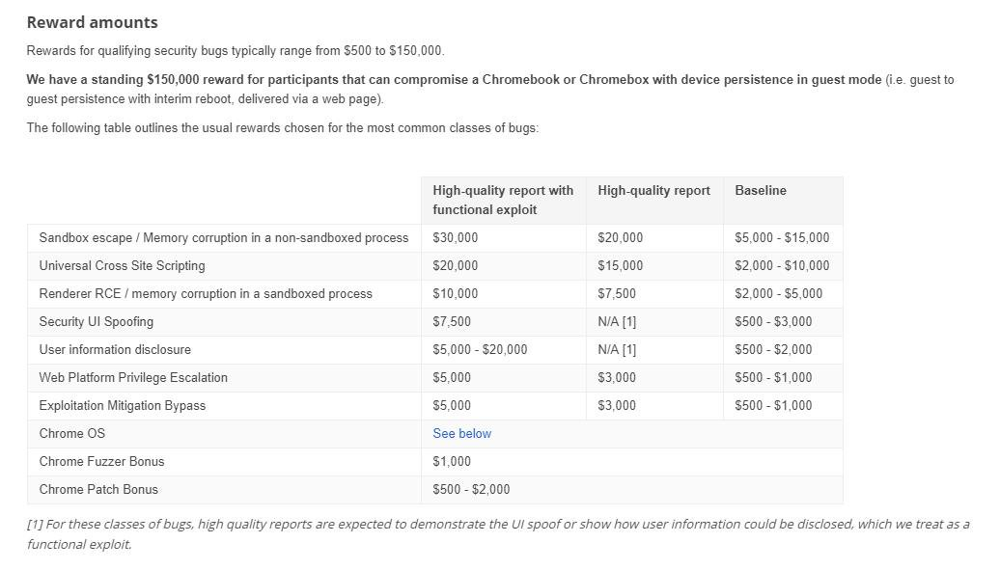
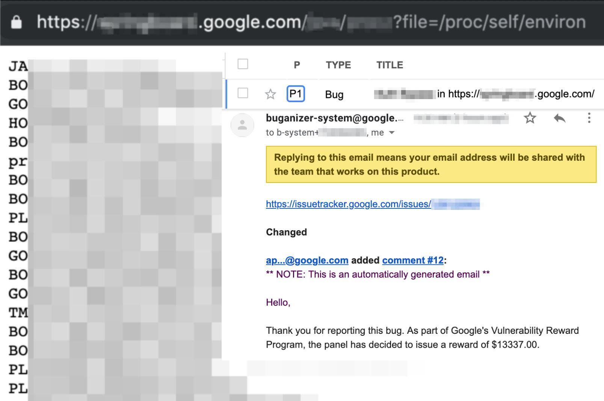
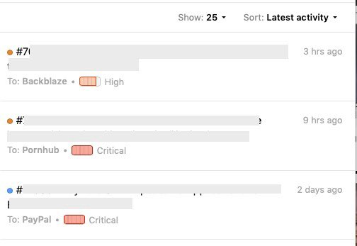
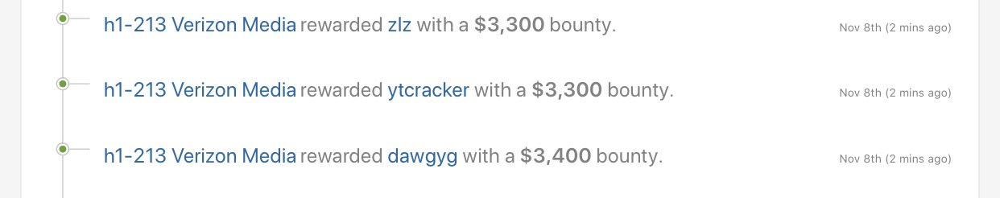

### 01 TotipotentRobot 导言与目标

#### 撰文初衷

鉴于有相当长一段时间没写有技术相关的文章,之前看到一位朋友公司某ai安全产品某一张介绍截图.由于有公司名字等消息在,我也不方便直接评价别人的产品,不合适也没有立场.  

本次的这个totipotent是临时想出来的名字,它的原型是玛卡瑞娜,是我另一个完整的,强可用性且已经投入使用的一个渗透测试专用机器人.能够大幅减少我的工作量,但是不敢说能怎么怎么样,想贴出h1的$8300刀的奖励截图,又感觉实属没有必要装这个x.  

那为什么要分享这个系列文章或者教程呢?我纯粹是无聊...  

#### 系列目录
```
一 导论与目标
二 机器人综述和举例
三 NLP聊天机器人技术介绍与实现
四 渗透测试任务机器人
```

也许会随时调整,草草列的目录,因为还没开始撰稿...  

#### 目标思维导图

  

用xmind作图时闪退了,其实response下面还有两个子主题对应query的..  

分别是`语音输出` 和 `文本输出`  .  


### 补充之前一万美刀漏洞说明

之前有几个小朋友问我怎么会有1w美刀漏洞,是不是我ps的...  

我这里可以说明一下,一,我不会使ps这种高大上的软件,我只会一点点pr.  

二,补一张详情图吧.我要打多次码了,这是一个存储型xss,很多刷补天或者国内的src的小伙子就很疑惑,不可能啊,xss不是忽略就是人民币200...  就算是storedxss也就是1500.怎么会有1w刀,近6wrmb呢.  


  

首先这漏洞出现在某邮箱且带上了csp bypass,也就是说在漏洞评分的时候,可利用性会上升一个档次,可以看到severity是8.8  

贴一张漏洞定价的图和别人比较高的漏洞奖金图:  

  

  

由于这段时间比较缺钱,所以拿出来这个没啥用的玩意提交下,其实我还有国内某1 某q
国外某w 的和这个很相似的漏洞.说不定在后续还有需要.  

其实我一直想突破的是Gmail的,一直听说有人搞定了,但是我技术水平不行,一直没发现突破点在哪里.  

也10号了,1/3,又可以发装x的漏洞奖金图了.  

  

  

哦 忘记给pornhub打码了,我去这个站主要是为了挖漏洞... 应该可以理解的.
