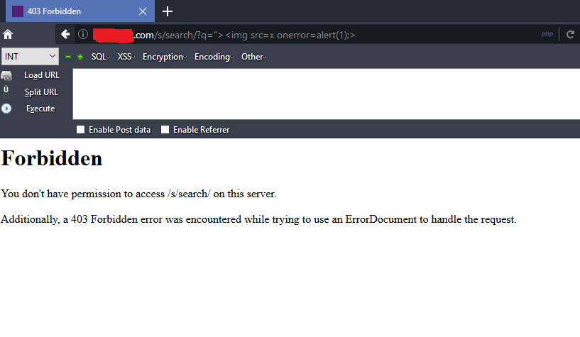
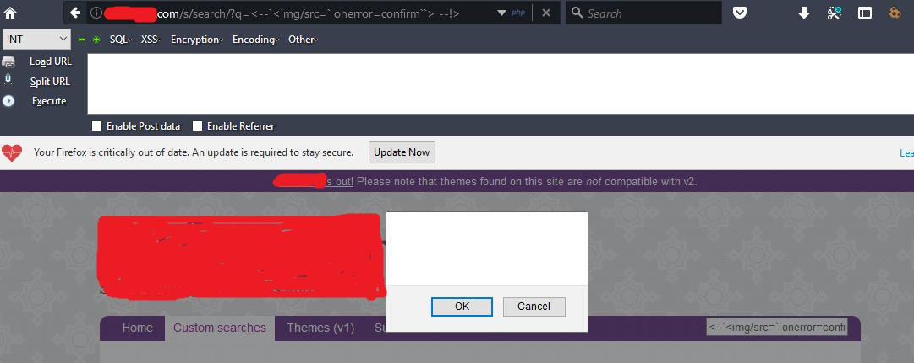

### 02 TotipotentRobot机器人概述

#### 机器人概述
将一些机器人的例子用简单的代码示例出来.  
直接上代码吧,比较简单,只是举个例子.  

##### 基础版本:rule-base robot  
见`/code/rule-base.py`  


```python
import random
# 打招呼
greetings = ['hola', 'hello', 'hi', 'Hi', 'hey!','hey']
# 回复打招呼
random_greeting = random.choice(greetings)
# 对于“你怎么样？”这个问题的回复
question = ['How are you?','What are you doing?','How']
# “我很好”
responses = ['Okay',"I'm fine"]
# 随机选一个回
random_response = random.choice(responses)
# 机器人跑起来
while True:
    userInput = input(">>> ")
    if userInput in greetings:
        print(random_greeting)
    elif userInput in question:
        print(random_response)
    # 除非你说“拜拜”
    elif userInput == 'bye':
        break
    else:
        print("I did not fucking understand what you said")
```

运行结果:  


##### 升级之精准对答:intents-base robot
透过关键词来判断这句话的意图是什么（intents）  
见`/code/intents-base.py`  


```python
from nltk import word_tokenize
import random

# 打招呼
greetings = ['hola', 'hello', 'hi', 'Hi', 'hey!','hey']
# 回复打招呼
random_greeting = random.choice(greetings)
# 对于“假期”的话题关键词
question = ['break','holiday','vacation','weekend']
# 回复假期话题
responses = ['It was nice! I went to Paris',"Sadly, I just stayed at home"]
# 随机选一个回
random_response = random.choice(responses)

# 机器人跑起来
while True:
    userInput = input(">>> ")
    # 清理一下输入，看看都有哪些词
    cleaned_input = word_tokenize(userInput)
    # 这里，我们比较一下关键词，确定他属于哪个问题
    if  not set(cleaned_input).isdisjoint(greetings):
        print(random_greeting)
    elif not set(cleaned_input).isdisjoint(question):
        print(random_response)
    # 除非你说“拜拜”
    elif userInput == 'bye':
        break
    else:
        print("I did not understand what you said")
```
##### 升级之知识体系:graph-base robot

光是会BB还是不行，得有知识体系！才能解决实际的问题。  
见`/code/graph-base.py `   
我们可以用各种数据库，建立起一套体系，然后通过搜索的方式，来查找答案。  
比如，最简单的就是Python自己的graph数据结构来搭建一个“地图”。  
依据这个地图可以清楚的找寻从一个地方到另一个地方的路径，
然后作为回答，反馈给提问者  

```python
#coding:utf-8
#by finger on 02.md
# 建立一个基于目标行业的database
# 比如 这里我们用python自带的graph
graph = {'上海': ['苏州', '常州'],
         '苏州': ['常州', '镇江'],
         '常州': ['镇江'],
         '镇江': ['常州'],
         '盐城': ['南通'],
         '南通': ['常州']}

# 明确如何找到从A到B的路径
def find_path(start, end, path=[]):
    path = path + [start]
    if start == end:
        return path
    if start not in graph:
        return None
    for node in graph[start]:
        if node not in path:
            newpath = find_path(node, end, path)
            if newpath: return newpath
    return None
```


##### 升级之前后端分离

这里只是个样例,假设我们使用的google的api,比如是gTTS(Google Text-to-Speech API),(其实一般用百度的tts就很不错,但是好像超过xx额度后就收费了)..  

除了文本到语音,还有一个就是朗读出回复内容.  
见 `/code/tts-base.py` 和 `/code/speak-base.py`  

```python
#coding:utf-8
#by finger on 02.md

from gtts import gTTS
import os
tts = gTTS(text='您好，我是您的私人助手，我叫zcc', lang='zh-tw')
tts.save("hello.mp3")
os.system("mpg321 hello.mp3")

```

以及:

```python
#coding:utf-8
#by finger on 02.md
# 安装几个库 SpeechRecognition, PyAudio 和 PySpeech

import speech_recognition as sr
from time import ctime
import time
import os
from gtts import gTTS
import sys

# 讲出来AI的话
def speak(audioString):
    print(audioString)
    tts = gTTS(text=audioString, lang='en')
    tts.save("audio.mp3")
    os.system("mpg321 audio.mp3")

# 录下来你讲的话
def recordAudio():
    # 用麦克风记录下你的话
    r = sr.Recognizer()
    with sr.Microphone() as source:
        audio = r.listen(source)

    # 用Google API转化音频
    data = ""
    try:
        data = r.recognize_google(audio)
        print("You said: " + data)
    except sr.UnknownValueError:
        print("Google Speech Recognition could not understand audio")
    except sr.RequestError as e:
        print("Could not request results from Google Speech Recognition service; {0}".format(e))

    return data

# 自带的对话技能（rules）
def jarvis():

    while True:

        data = recordAudio()

        if "how are you" in data:
            speak("I am fine")

        if "what time is it" in data:
            speak(ctime())

        if "where is" in data:
            data = data.split(" ")
            location = data[2]
            speak("Hold on Tony, I will show you where " + location + " is.")
            os.system("open -a Safari https://www.google.com/maps/place/" + location + "/&amp;")

        if "bye" in data:
            speak("bye bye")
            break

# 初始化
time.sleep(2)
speak("Hi Tony, what can I do for you?")

# 跑起
jarvis()

```

### 福利部分

一个实际案例xss bypass:  

  
  

h1给了$xxx.  
